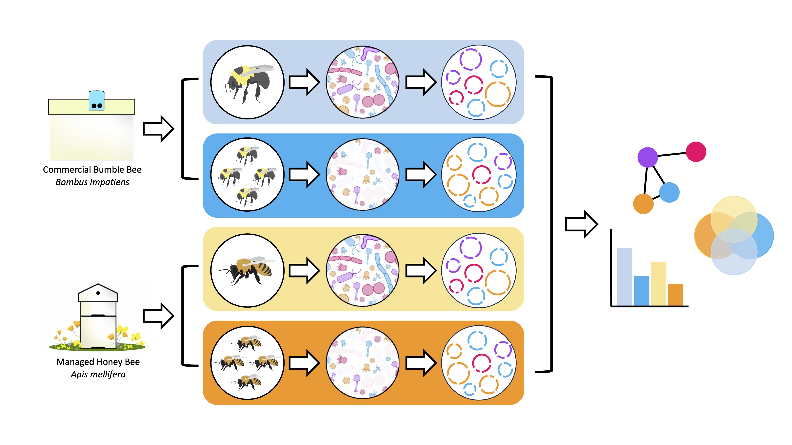

# Bee_phage_2023
This repository contains code and files generated for the publication "**Targeted Viromes and Total Metagenomes Capture Distinct Components of Bee Gut Microbiomes**" [DOI GO HERE]. Sequence read files can be accessed from the NCBI SRA under the bioproject PRJNA1072153. 

There is a collection of files and folders in this repository. Here is a brief description of them:

### read_processing
This folder contains the code which was used to quality filter and clean the raw sequencing reads produced in this manuscript. 

### assembly
This folder contains two main things:
- First, this is where you will find the code we used to build contigs from reads, extract phage sequences from assembled contigs, and cluster putative phage into vOTUS.
- Second, this folder contains code for annotating predicted vOTUs and for building gene-sharing networks. 
- We have also included in this folder the .fa files containing the "genomes" of all the vOTU seqs we identified, along with the previosuly described bee phage seqs.

### network
This folder contains scripts and code used for cleaning up the output produced by vContact2. This includes code for inferring phage taxonomy and imporivng bacterial host assignment.

### vOTU_table_construction
This folder contains raw results, code, and dataframes used for constructing the vOTU table which is used through out the publication. The "master" metadata table is also held in this folder. This is a usefull starting point if you are trying to recreate any of the analysis performed in this manuscript. More information regarding individual files can be found in the folder.

### sum_data
In short, this is the data used to build many components of Figure 2. This folder contans basic summary info regarding:
- The assembly of our read data into contigs
- the number of phage we recovered in each sample
- The code used to calculate these data. 

### calc_kmers
This is the code (and raw data) used to produce the read library complexity results visualized in Figure 2.

### rare_curve
This folder contains code used for generating the species accumulation curves featured in our manuscript.

### temperate_prediction
This folder contains the code we used for predicting temperate phage from our annotated phage sequences.

### MAG_construction
There is only one file here and it contains the code we used for constructing our metagenome assebled genomes (MAGs). We chose not to include intermediate files here becasue they are quite large. These MAGs were not really used for much in our study (just CRISPR spacer minning), but they are of fairly high-quality. Please, use them for something! 

### host_prediction
There is a fair amount going on here. Overall, this folder contains the code we used for performing the CRISPR spacer analysis which predicted the hosts of our vOTUs. We do this by:
- Collecting sequencing metadata from a number of NCBI assemblies of bacterial genera known to associate with honey and bumble bees
- We then use that metadata to download only the most high-quality assemblies of these common bee bacteria. 
- After this, we mine CRISPR spacer sequences from both these publicly available assemblies and the bacterial MAGs we generate in our study (see above). 
- Once CRISPR spacers are mined, we map them to our vOTU genomes in order to make host predictions. 

### kraken2
This folder contains the code we used to predict bacterial communities from sequencing reads via kraken2 and bracken. It also contains the .biom file produced by these tools.

### plots
This is probably one of the most important folder here. It contains all of the code (and some of the associated data) used to perform our different analyses. It is broken down by our different plots -- each being contained within their own sub directory. These are as follows: 
- sequencing_overview: This directory contains code and data used to create **Figure 2** (the figure describing our raw sequencing data at a fairly high level). As discussed above, some of the code used to generate the data objects in this directory are held within the dir sum_data.
- host_network: This is where our code for describing phage communities in terms of targeted bacterial hosts lives (**Figure 3**). The code here will pull some data from assembly>network>no_ref. Note: Cytoscape was used to visualize our network object. The network object is "decorated" here (i.e. adding usefull metadata to color labels on), but the actual visualization is not (we used Cytoscape in a GUI format). 
- alpha_beta_div: This folder contains code used to compare how alpha and beta diversity of phage communities differs between host bee species and sampling method (basically, this is **Figure 4**). Some of the data used for this code is held within vOTU table construction. 
- bacterial_community: This contains code for **Figure 5** -- describing the diversity and density of our bacterial communities. It uses the .biom file produced by kraken2/braken. The raw qPCR data (which this code uses) is also held within this directory.  
- virome_vs_total: Here you will find our code which delves into how why viromes and total metagenomes recover fundementally different phage communities (**Figure 6**). 
